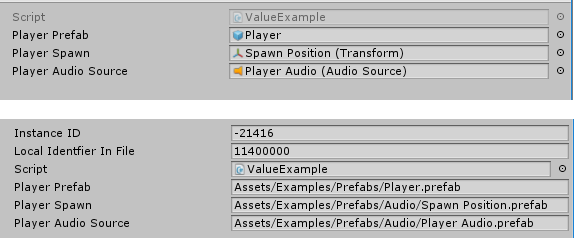
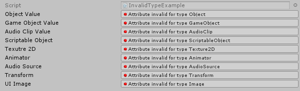
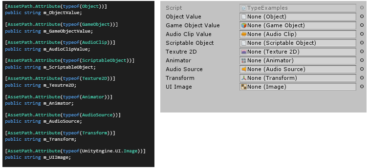

# AssetPathAttribute

AssetPathAttribute is a Unity attribute used in Unity to allow you to have drag and drop asset references in the inspector but really only serialize string paths.


### Why?
If you use object references in Unity when you load one asset every asset it references is also loaded into memory and this is not really ideal. The other option is to load everything from resources by using it's path. So instead of having a direct reference you have a string field. These are really hard to work with as it's easy to make a mistake and if the asset moves and has become invalid you will not know. You also can't jump between objects very quickly. This is a huge hit to usability. Asset Path Attribute combines the best of both options into one using some inspector magic. 


### How it works



 In the top box we have the inspector in normal mode. As you can see there are object references. However when you go to debug mode you will see we have string paths. This is what AssetPathAttribute does. The code for the asset path inspector drawn above is the following


 ```csharp
 [CreateAssetMenu]
public class ValueExample : ScriptableObject
{
    [AssetPath.Attribute(typeof(GameObject))]
    public string m_PlayerPrefab;

    [AssetPath.Attribute(typeof(Transform))]
    public string m_PlayerSpawn;

    [AssetPath.Attribute(typeof(AudioSource))]
    public string m_PlayerAudioSource;
}
 ```

 As seen above all you need to do is add the `AssetPath.Attribute(Type)` above a string field. When Unity goes and draws that string field it will instead use the `AssetPathDrawer.cs` and create your object field. If you put the attribute above a invalid type (anything but a string) the inspector will show the following.

 

 Instead of just defaulting back to the normal inspector (which would be really easy to do) I display a error just so you know you are currently referencing the object directly. 


 ### Valid Targets
 Asset Path Attribute just piggybacks off the Unity serialization system and can't draw object fields for types that Unity does not support. Any type that inherits from `UnityEngine.Object` can be used with AssetPathAttribute. 

  

 ## Helper Functions
 When working with Asset Path Attribute it store all paths as project paths i.e all start at the base `Assets/` folder. In terms of runtime this is not useful to you since to load objects they need to be in a `Resources` folder. To convert a Project Path to a Resources path you can use the following.
 ```csharp
 public class UIManager
 {
    [AssetPath.Attribute(typeof(UnityEngine.UI.Image))]
    public string m_UIImage;

    public void ConvertExample()
    {
        // Takes a path from 'Assets/Resources/Player/PlayerIcon.prefab'
        // and converts it to `Player/PlayerIcon.prefab'
        string resourcesPath = AssetPath.ConvertToResourcesPath(m_UIImage);
    }
 }
 ```

 You can then go ahead and load the asset using `Resources.Load<T>(string path)` There is a second function that you can also use that will load the object for you.
 ```csharp
[AssetPath.Attribute(typeof(GameObject))]
public string m_PlayerPrefab;

public void CreatePlayer()
{
    // Converts our path to a resources path and then loads the object.
    GameObject player = AssetPath.Load<GameObject>(m_PlayerPrefab);
}
 ```
 The advantage of using this function is it's much cleaner and also in the Editor if the object could not be find in a Resources folder an attempt to load it using `AssetDatabase.Load(string path)`. This is really useful for any editor windows that might be using AssetPathAttribute. 


 ## TODO:
 * Validate that the type sent in to `AssetPath.Attributes` constructor is serializable. Display a error string if it's not.

 
## Meta

Handcrafted by Byron Mayne [[twitter](https://twitter.com/byMayne) &bull; [github](https://github.com/ByronMayne)]

Released under the [MIT License](http://www.opensource.org/licenses/mit-license.php).

If you have any feedback or suggestions for AssetPathAttribute feel free to contact me. 
